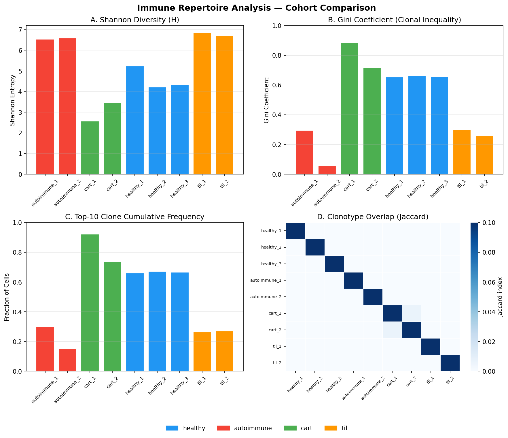

# TCR/BCR Immune Repertoire Analysis

A Python toolkit for analysing T-cell and B-cell receptor repertoires from 10x VDJ or AIRR-format data — directly applicable to immune-mediated disease research, CAR-T cell therapy monitoring, and tumour-infiltrating lymphocyte characterisation.

## Biological motivation

Immune repertoire diversity is a fundamental readout in:
- **Autoimmune disease**: oligoclonal expansion and V-gene skewing indicate antigen-driven pathology
- **CAR-T cell therapy**: dominant CAR-T clones visible post-infusion; exhaustion reduces diversity
- **Tumour immunology**: TIL clonotype expansion reflects antigen-specific tumour-reactive T cells
- **Patient stratification**: diversity metrics predict treatment response in checkpoint immunotherapy

## Features

- Clonotype counting and frequency analysis (AIRR / 10x Genomics formats)
- Diversity metrics: Shannon entropy, Simpson index, Gini coefficient
- Clonal expansion classification (rare → hyperexpanded)
- V-gene usage analysis for antigen-driven bias detection
- Pairwise Jaccard clonotype overlap between patients/samples
- Publication-ready 4-panel summary figures
- Synthetic data generator (healthy, autoimmune, post-CAR-T, TIL cohorts)

## Quick start

```bash
git clone https://github.com/Nikhila123456/tcr-repertoire-analysis.git
cd tcr-repertoire-analysis
pip install -r requirements.txt

python data/generate_synthetic.py   # generate test data
python analyse_repertoire.py        # run full analysis → results/
```

## Results (synthetic cohort comparison)



| Metric | Healthy | Autoimmune | Post-CAR-T | TIL |
|--------|---------|------------|------------|-----|
| Shannon H | High | Low | Low | Medium |
| Gini | Low | High | High | Medium-high |
| Top-10 freq | ~0.15 | ~0.70 | ~0.80 | ~0.45 |

## Integration with scRNA-seq

For paired scRNA-seq + VDJ analysis (Seurat / scirpy):
```python
from src.repertoire import count_clonotypes, compute_diversity
clones = count_clonotypes(df, by="junction_aa")
diversity = compute_diversity(clones)
```

## References

1. Sturm G et al. scirpy: a Scanpy extension for analysing single-cell T-cell receptor sequencing data. *Bioinformatics* (2020).
2. Bolotin DA et al. MiXCR: software for comprehensive adaptive immunity profiling. *Nature Methods* (2015).
3. Rosenblatt J et al. Individualized vaccination of AML patients in remission. *Blood* (2016) — Gini coefficient for clonal dominance.

## Author

Nikhila T. Suresh, PhD | [github.com/Nikhila123456](https://github.com/Nikhila123456)
